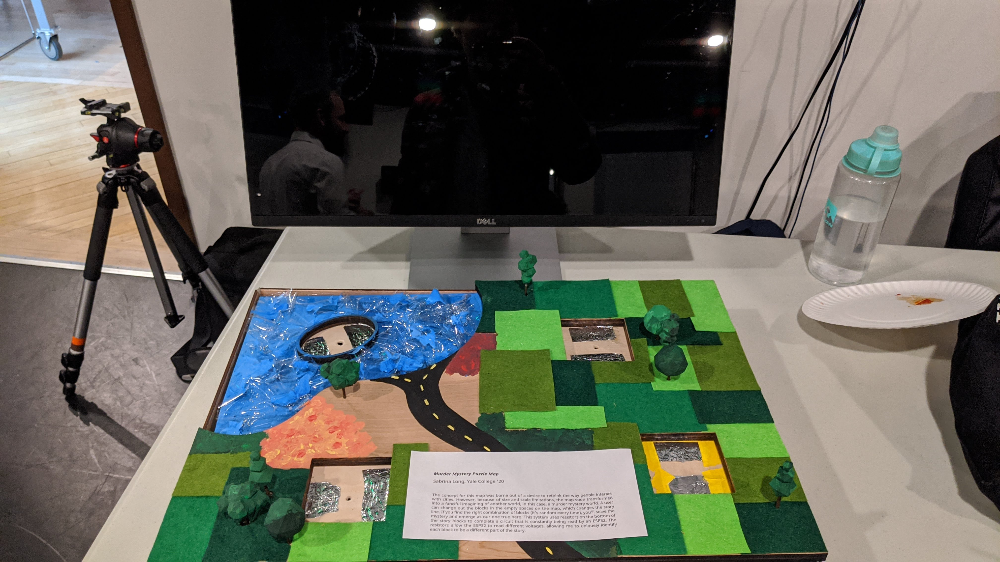
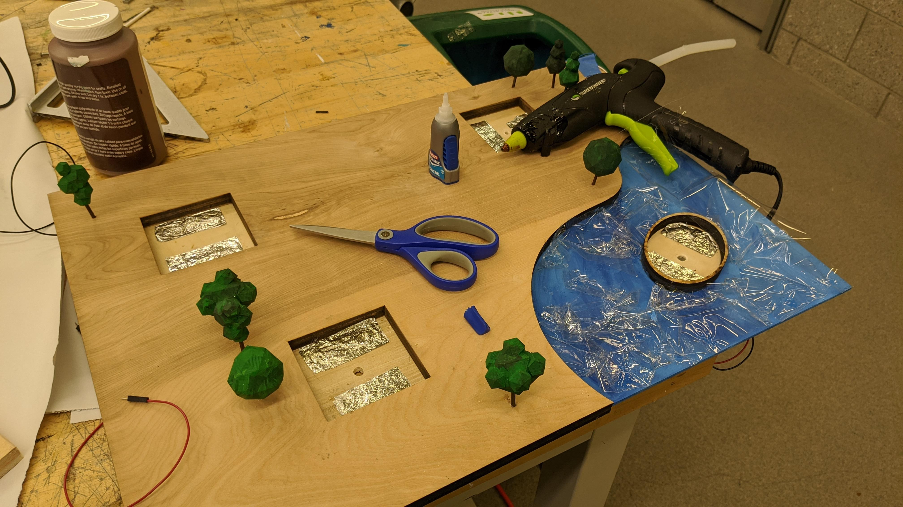
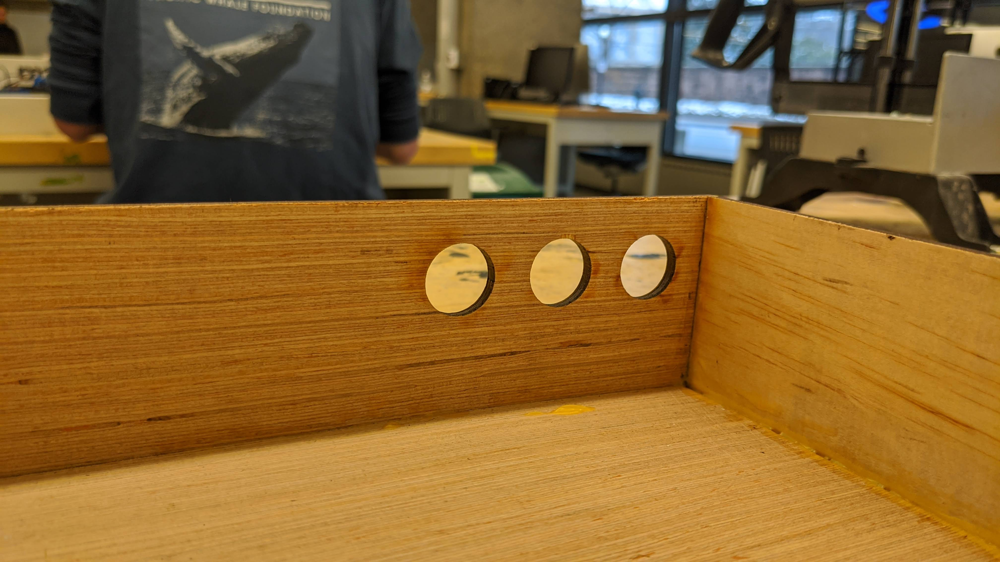
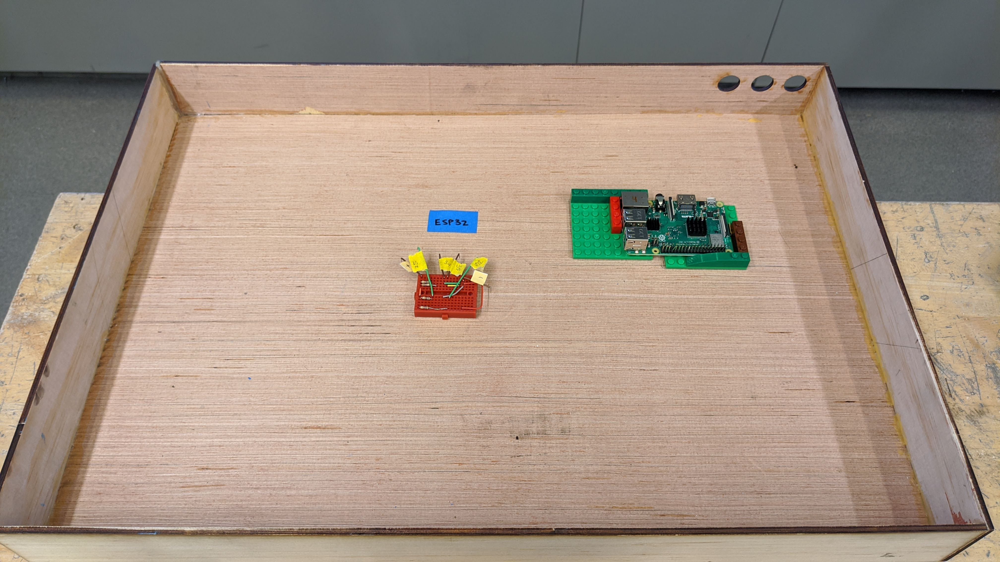
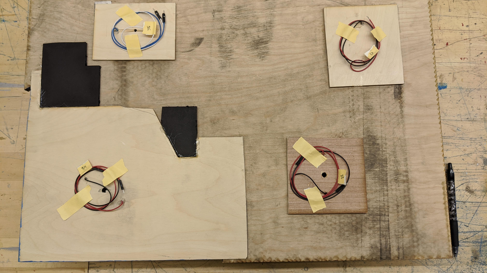
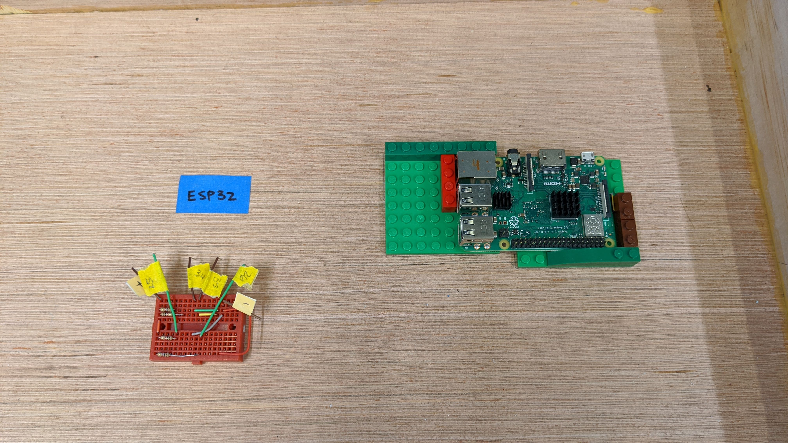
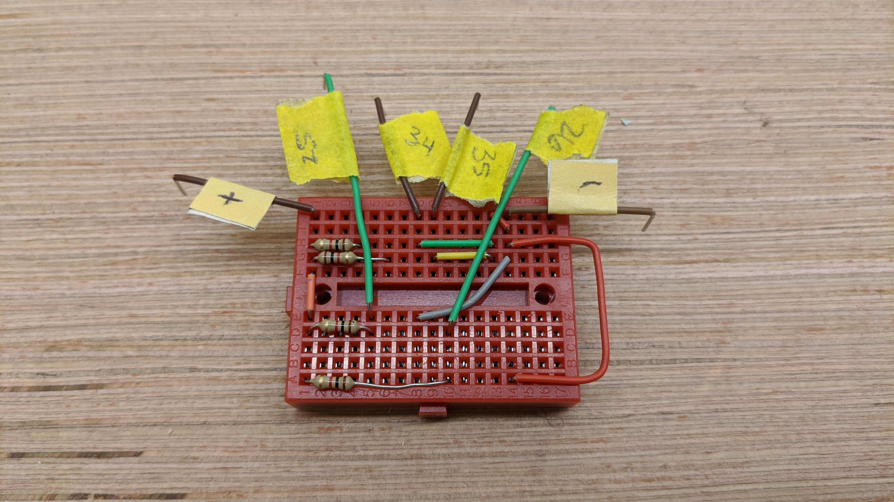

# CPSC334 Final Project - Murder Mystery Map Puzzle
Artist: Sabrina Long

Video link: https://youtu.be/4uagGxPUX4I

## Artist Statement
The concept for this map was borne out of a desire to rethink the way people interact with cities. However, because of size and scale limitations, the map soon transformed into a fanciful imagining of another world, in this case, a murder mystery world. A user can change out the blocks in the empty spaces on the map, which changes the story line. If you find the right combination of blocks (it’s random every time), you’ll solve the mystery and emerge as our one true hero. This system uses resistors on the bottom of the story blocks to complete a circuit that is constantly being read by an ESP32. The resistors allow the ESP32 to read different voltages, allowing me to uniquely identify each block to be a different part of the story. 

## Key Functionality
This map allows the user to mix and match pieces on a board, similar to a board game, to change pieces of a text story. The murdery mystery story is constantly changing as the user changes the blocks, and will only be solved when the correct combination of blocks is read.

## Materials and Assembly

Enclosure
- Material for box sides and base (wood, acrylic, any)
- Material for top of box. This should be relatively firm and should have holes cut to fit the story blocks
- Story blocks (any shape, as many as you want, but at least as many as there are holes)
- Breadboard strip with power and ground only
- Paint

Steps:
1. Build the box sides and base. They should be relatively sturdy. Drill holes into the back panel (the side panel that will be facing away from you) to snake the wires out later.

2. Attach the base to the sides. Attach the breadboard to the center of the base and create some mount for the ESP32 and Raspberry Pi (see pictures).
3. Laser cut the top material if necessary. Laser cut the top blocks if necessary. Make sure they fit into one another.
4. Hot glue resistors in a crossed position on the underside of each story block. Make sure to label the block in some way.
5. Glue supports to the underside of the top material, so that each block has something to sit on top of.
6. Drill two holes on opposite sides of each support (they should be visible when viewed from above)
7. Snake a wire through the support so the wire strands are facing upwards. Layer tinfoil around the wire so that it is completely enclosed. This will be used to close the circuit with the resistors, so the connection must be checked thoroughly.
8. Paint the enclosure how you see fit

Electronics
- ESP32
- Raspberry Pi
- MicroUSB cable (x2, at least one data-transfer)
- Tinfoil
- Wires
- Resistors (x2 for each block, such that voltages are approximately )
- Breadboard strip

Steps:
1. Flash the code in city-story.ino to onto the ESP32
2. Connect the ESP32 to the Raspberry Pi with the data-transfer microUSB
3. Connect all wires from theto the ESP32 based on the city-story.ino pin labels
4. Clone this repo onto your Pi
5. Run create-story.py in Terminal. Download dependencies if necessary
6. Make sure that the voltages read correctly. Adjust the voltages in create-story.py if necessary

## Customizing the Story
The framework for creating the murder mystery story is laid out in the create-story.py script. The introduction asks the user for their name (used later) and some trivial input (used for interactivity). The instruction phase has no interaction. You can customize the time periods for these phases by adjusting the script.

To edit the body of the story, you will need to customize the text in the 'paragraphs' dictionary. Make sure the key for each entry matches the key names identified in landtags and landvals, seatags and seavals. Feel free to change the tag names to match the contents of your murdery mystery map. This script uses land and sea nomenclature because of the initial map layout. The clues in the story could help a player find the right set of blocks to put on the map, or they could create an endless story. Either way, how the story goes is up to you.
